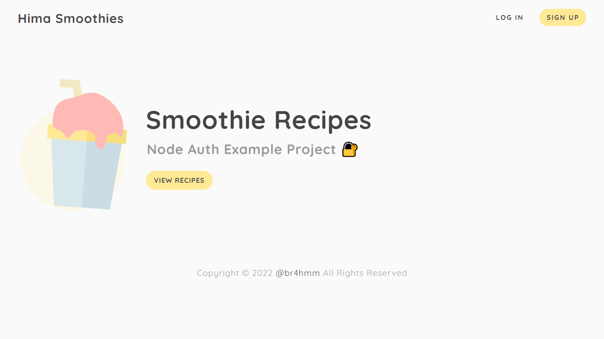
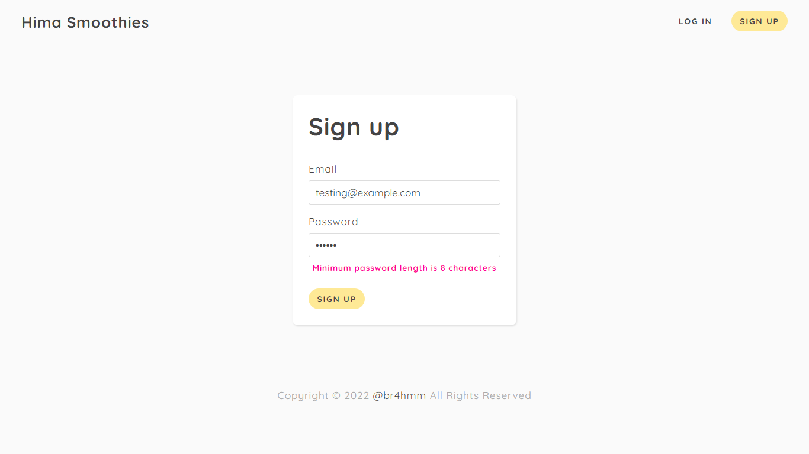
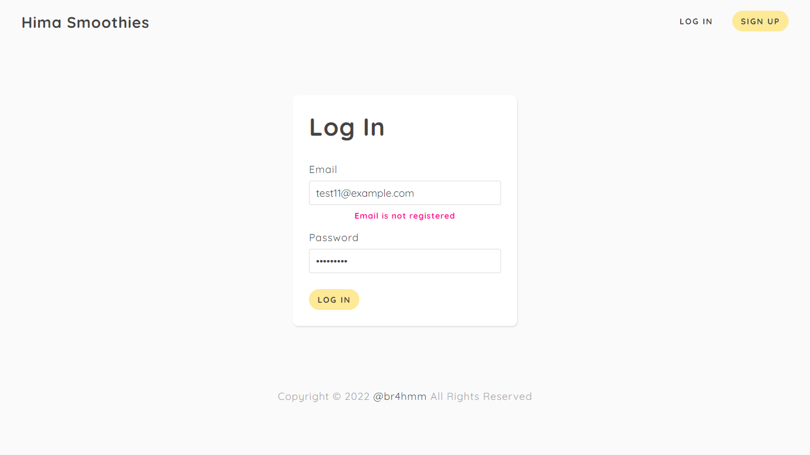
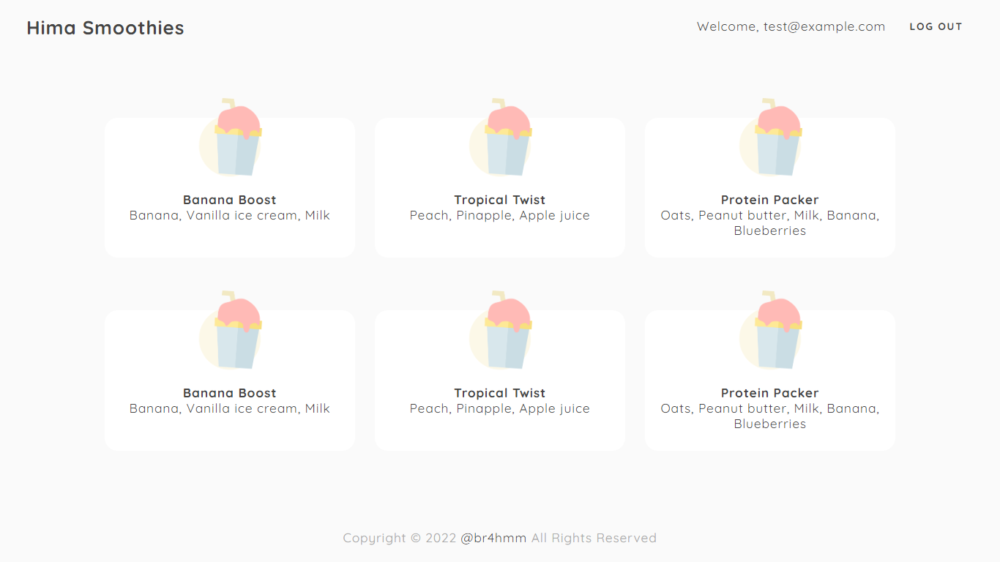

# Smoothies Recipes

Auth example project built with Express.js & MongoDB

## Demo

## All Routes

| About                       | HTTP Methods       |
| --------------------------- | ------------------ |
| Home page                   | `GET /`            |
| Sign up page                | `GET /signup`      |
| Log in page                 | `GET /login`       |
| Create a new user           | `POST /signup`     |
| Authenticate a current user | `POST /login`      |
| Smoothies page              | `GET /smoothies`   |
| Log a user out              | `GET /logout`      |
| Error page                  | `GET /*otherwise*` |

_Enjoy 💫_
